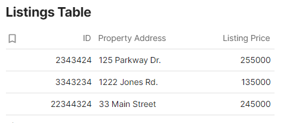

## REQUIREMENTS
1. Write a SQL script that can create a simple SQL table for listings 

2. Write a script to populate the DB with mock data for demo purposes.
3. Implement a simple REST API that has CRUD (Create, Read, Update, Delete) functionality for that database.
4. Write Unit Tests to ensure your API can be tested by other developers.
5. Document your code so another programmer can use it and expand on your code.

## Set up & Install

1. Create a virtual environment **venv** within the project directory - `python -m venv .venv`
2. Activate venv (example for mac) - `source venv/bin/activate`
3. Install requirements on a new terminal - `pip install -r requirements.txt`           
4. If step 3 fails, you can install 2 packages separately:          
- install **Flask** - `pip install flask`           
- install pytest - pip install pytest           
5. Run **connect_db.py** to make the database available - `python connect_db.py `
6. Run **app.py** to start the flask server and check CRUD operations - `python app.py`

## INTRO

This is a Flask application for demo purposes on CRUD operations related to properties table created with SQLITE.
The code contains:              
`connect_db.py` - first file to run which makes possible:     
    1. database connection (**sqlite**)              
    2. table creation (**property_listing**)        
    3. population with data (**mock**)          
`app.py` - main file to run for CRUD operations                 
`test.py` - test file with unit tests
